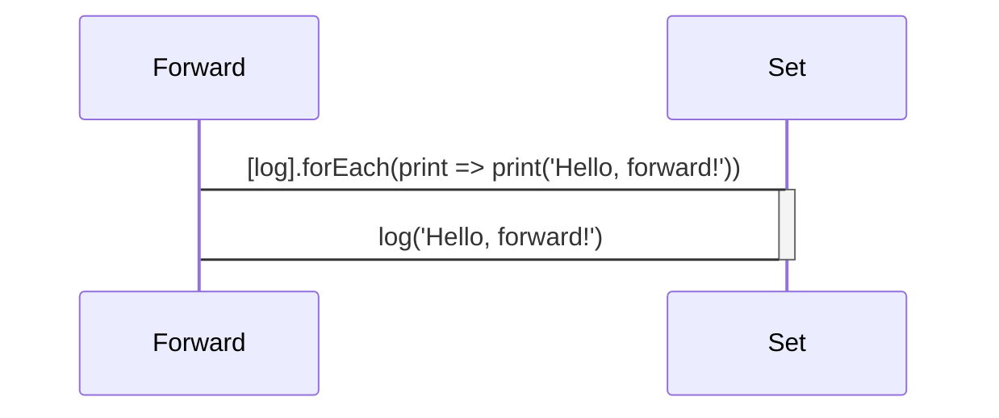
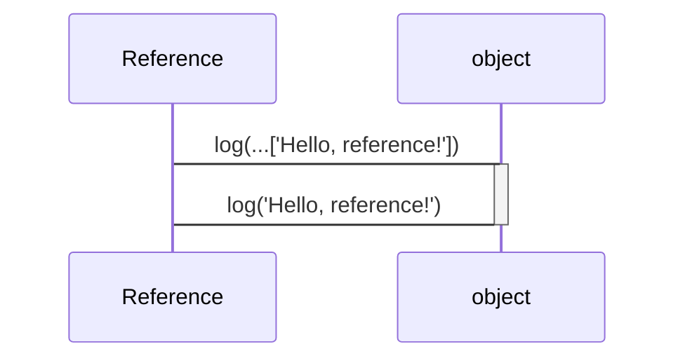
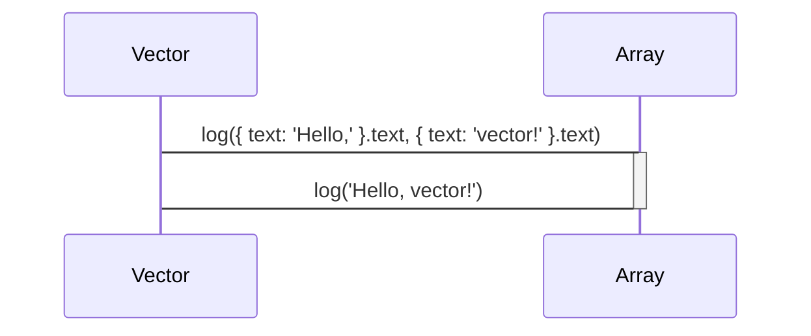
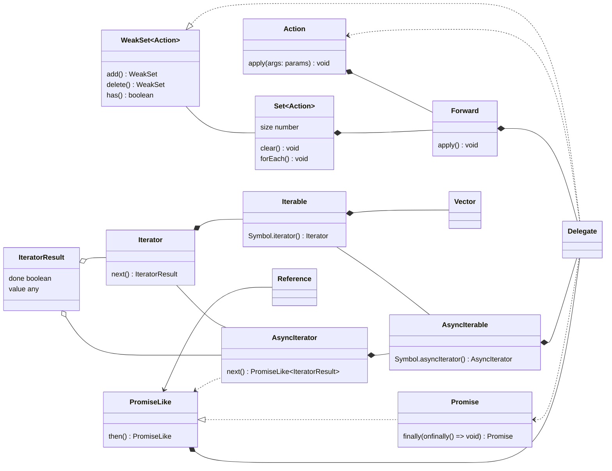

# Peekeasy

delegated proxy tools in typescript

[](https://www.npmjs.com/package/peekeasy)
[](https://github.com/domrally/peekeasy/actions/workflows/test.yml)
[](https://github.com/domrally/peekeasy/actions/workflows/publish.yml)

## Contents

- [**Use**](#Use)
  - [install](#install)
  - [examples](#examples)
    - [delegate](#delegate)
    - [forward](#forward)
    - [reference](#reference)
    - [vector](#vector)
- [**Contribute**](#Contribute)
  - [clone repo](#clone-repo)
  - [open directory](#open-directory)
  - [download dependencies](#download-dependencies)
  - [fix and format](#fix-and-format)
  - [run tests](#run-tests)
  - [build docs](#build-docs)
  - [deploy](#deploy)
- [**Project**](#Project)
  - [goals](#goals)
  - [non-goals](#non-goals)
  - [documentation](#documentation)
  - [structure](#structure)
  - [dependencies](#dependencies)
    - [internal](#internal)
    - [external](#external)

## Use

### install

```
npm i peekeasy
```

### examples

#### delegate

```ts
import { Delegate, Forward } from 'peekeasy'

const forward = new Forward<[string, string]>(),
	delegate = new Delegate(forward)

delegate.then(async message => console.log(...message))

// Hello, delegate!
forward('Hello,', 'delegate!')
```


#### forward

```ts
import { Forward } from 'peekeasy'

const forward = new Forward<[string]>(console.log)

// Hello, forward!
forward('Hello, forward!')
```



#### reference

```ts
import { Reference } from 'peekeasy'

const reference = new Reference('Hello, reference!')

// Hello, reference!
console.log(`${reference}`)
```



#### vector

```ts
import { Vector } from 'peekeasy'

const vector = new Vector({ text: 'Hello,' }, { text: 'vector!' })

// Hello, vector!
console.log(...vector.text)
```



## Contribute

### clone repo

```
gh repo clone domrally/peekeasy
```

### open directory

```
cd Documents/Github/peekeasy
```

### download dependencies

```
npm i
```

### fix and format

```
npm stop
```

### run tests

```
npm test
```

### build docs

```
npm start
```

### deploy

merge a [pull request](https://github.com/domrally/peekeasy/compare) into `main` to publish to **npm**

## Project

### goals

- syntactic sugar in typescript for
  - [state pattern](https://en.wikipedia.org/wiki/State_pattern)
- implementations for built-in javascript types
  - [`Set`](https://developer.mozilla.org/en-US/docs/Web/JavaScript/Reference/Global_Objects/Set) and [`WeakSet`](https://developer.mozilla.org/en-US/docs/Web/JavaScript/Reference/Global_Objects/WeakSet) interfaces
  - `Iterable`, `Iterator`, `IterableIterator`, and `IteratorReturnResult`
  - [`for await...of`](https://developer.mozilla.org/en-US/docs/Web/JavaScript/Reference/Statements/for-await...of) and [`Proxy`](https://developer.mozilla.org/en-US/docs/Web/JavaScript/Reference/Global_Objects/Proxy) objects
- bring concepts to typescript from
  - C# [`delegates`](https://docs.microsoft.com/en-us/dotnet/csharp/programming-guide/delegates/) and [`events`](https://docs.microsoft.com/en-us/dotnet/csharp/programming-guide/events/)
  - [array programming](https://en.wikipedia.org/wiki/Array_programming)

### non-goals

- an event system
- an app framework
- a state machine framework
- an implementation of an observer pattern

### documentation

https://domrally.github.io/peekeasy

### structure

- [.github/](https://github.com/domrally/peekeasy/tree/main/.github)
  - [workflows/](https://github.com/domrally/peekeasy/tree/main/.github/workflows)
- [docs/](https://github.com/domrally/peekeasy/tree/main/docs)
  - [assets/](https://github.com/domrally/peekeasy/tree/main/docs/assets)
  - [classes/](https://github.com/domrally/peekeasy/tree/main/docs/classes)
  - [modules/](https://github.com/domrally/peekeasy/tree/main/docs/modules)
- [src/](https://github.com/domrally/peekeasy/tree/main/src)
  - [exports/](https://github.com/domrally/peekeasy/tree/main/src/exports)
  - [tests/](https://github.com/domrally/peekeasy/tree/main/src/tests)
    - [example/](https://github.com/domrally/peekeasy/tree/main/src/tests/example)
    - [integration/](https://github.com/domrally/peekeasy/tree/main/src/tests/integration)
		- [four/](https://github.com/domrally/peekeasy/tree/main/src/tests/integration/four)
	   - [one/](https://github.com/domrally/peekeasy/tree/main/src/tests/integration/one)
		- [three/](https://github.com/domrally/peekeasy/tree/main/src/tests/integration/three)
		- [two/](https://github.com/domrally/peekeasy/tree/main/src/tests/integration/two)
    - [unit/](https://github.com/domrally/peekeasy/tree/main/src/tests/unit)
      - [delegate/](https://github.com/domrally/peekeasy/tree/main/src/tests/unit/delegate)
      - [forward/](https://github.com/domrally/peekeasy/tree/main/src/tests/unit/forward)
      - [reference/](https://github.com/domrally/peekeasy/tree/main/src/tests/unit/reference)
      - [vector/](https://github.com/domrally/peekeasy/tree/main/src/tests/unit/vector)

### dependencies

#### internal



#### external

[](https://prettier.io)
[](https://nodejs.org)
[](https://www.typescriptlang.org)
[](https://typestrong.org/ts-node)
[](https://eslint.org)
[](https://www.json.org/json-en.html)
